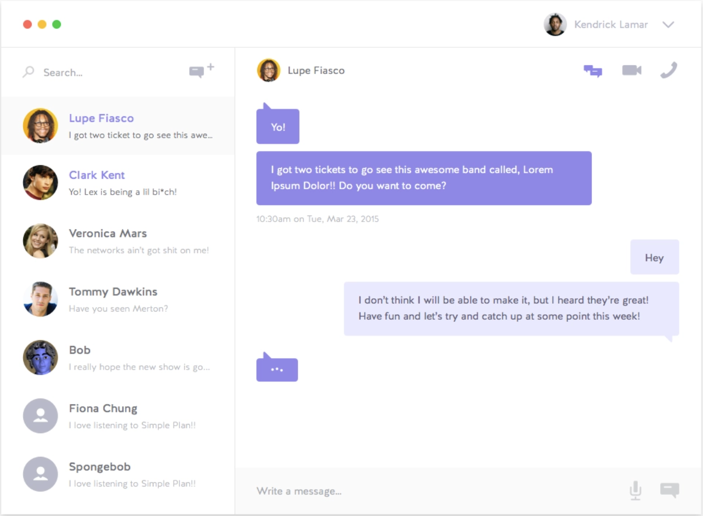

# Cion Studio Interview Task

## Task Details

Create an app based on the design in the image below. You do not have to create a working chat app, we are just testing your ability to create a UI from a design. 

* Use Redux toolkit to store state data and create reducers for any necessary updates. You can build on the slice in /src/redux/slices/chatSlice.js. Feel free to modify the slice any way you like, or create new slices if you need to.

* Create the styling using only vanilla CSS, do not use Bootstrap, Material UI, or similar frameworks. 

* Share your finished product with us on GitHub, and set up a live demo and share the URL with us. 

* Use your creativity for finishing touches like hover and active states. 

* (optional) You can use the library faker.js to generate mock data for names, messages, etc. (https://github.com/marak/Faker.js/)

### Running a local version of the app

- Launch the app
	- > `npm start`
		

## Applications Stack configurations and informations

### CLIENT
- React + Redux Toolkit
- Active on PORT 3000
- [localhost:3000](http://localhost:3000)